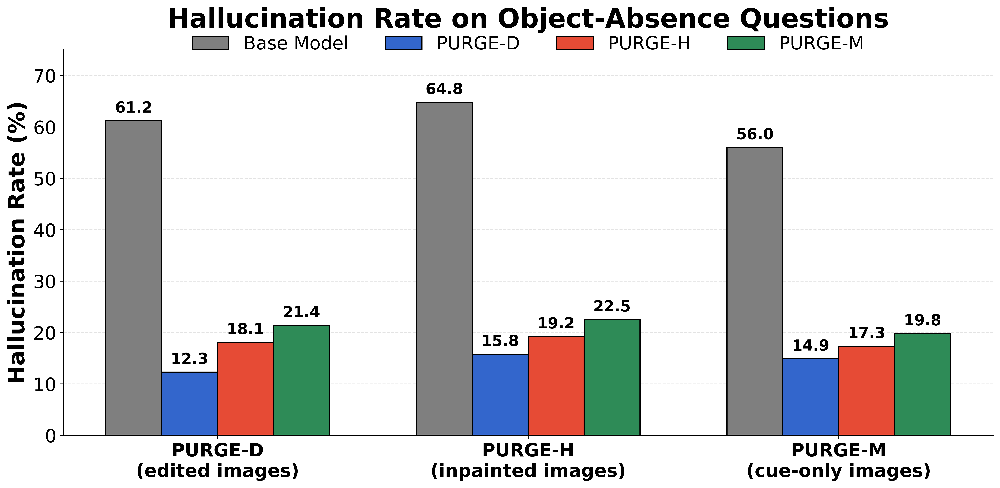

## Additional Analysis

To further investigate context-driven shortcut reliance, we evaluate the base model and the three PURGE variants on the held-out test sets of our PURGE datasets. These controlled test sets contain images where the target object is absent while contextual information is preserved or carefully controlled (edited, inpainted, or cue-only). Compared with the base model, all PURGE variants substantially reduce context-driven false-positive predictions, providing additional evidence that partition-aware unlearning reduces reliance on spurious contextual cues.

  

**Figure.** Hallucination rate on the held-out PURGE-D, PURGE-H, and PURGE-M test sets. Lower is better.
